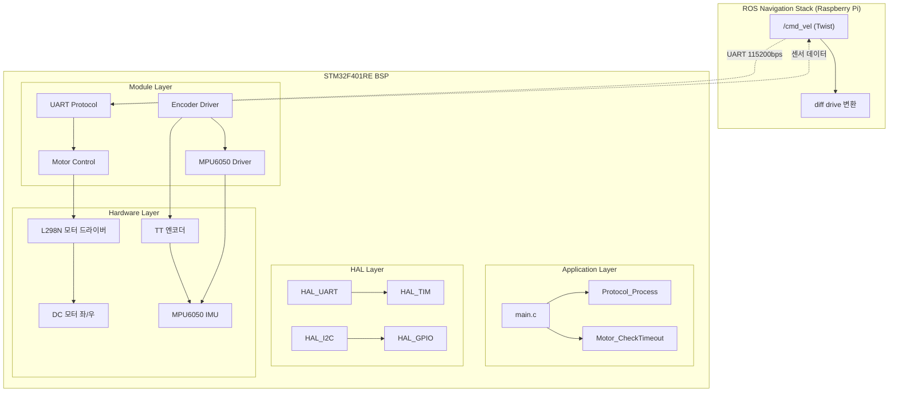

# BSP (Board Support Package) - 재난 대응 자율주행 로봇 제어 시스템

**STM32F401RE 기반 실시간 하드웨어 제어 펌웨어**

산업 안전 재난 대응 자율주행 로봇의 **하드웨어 제어 계층**으로, Hanwha Vision AI CCTV가 감지한 위험 좌표로 ROS 기반 로봇이 자율 이동할 때 실제 바퀴 구동과 센서 데이터 수집을 담당합니다.

---

## 🚀 시스템 개요

### 핵심 기능

| 기능 | 설명 | 구현 상태 |
|------|------|-----------|
| **모터 제어** | L298N 드라이버를 통한 양쪽 바퀴 독립 속도 제어 (PWM) | ✅ 완료 |
| **UART 프로토콜** | Raspberry Pi 4와 바이너리 패킷 통신 (명령 수신 / 센서 데이터 송신) | ✅ 완료 |
| **엔코더** | 쿼드러처 엔코더로 좌우 바퀴 회전수 측정 (TIM3/TIM4) | 🔄 기본 구현 |
| **IMU 센서** | MPU6050 6축 가속도/자이로 데이터 수집 (I2C1) | 🔄 기본 구현 |
| **안전 기능** | 가속도 제한, 명령 타임아웃(500ms), 비상 정지 | ✅ 완료 |
| **PID 속도 제어** | 엔코더 피드백 기반 정확한 속도 제어 | ⏸️ 미구현 |
| **오도메트리** | 엔코더 카운트 → 이동 거리/각도 변환 | ⏸️ 미구현 |

### 하드웨어 구성

| 부품 | 모델 | 역할 | 핀 연결 |
|------|------|------|--------|
| **MCU** | STM32 NUCLEO-F401RE | 메인 컨트롤러 (Cortex-M4, 84 MHz) | - |
| **모터 드라이버** | L298N | DC 모터 방향/속도 제어 | PA0/PA1(PWM), PC0~PC3(DIR) |
| **구동 모터** | DFRobot FIT0450 (TT 모터 + 엔코더) x2 | 바퀴 구동 + 회전수 측정 (기어비 120:1, 1920 PPR) | PA6/PA7(좌), PB6/PB7(우) |
| **IMU 센서** | MPU6050 (GY-521) | 6축 IMU (자세 측정) | PB8(SCL), PB9(SDA) |
| **상위 시스템** | Raspberry Pi 4 | ROS 노드, UART로 STM32와 통신 | PA9/PA10(UART1) |
| **디버깅** | PC USB | printf를 활용한 디버깅 | PA2/PA3(UART2) |

---

## 🏗 시스템 아키텍처

### 블록 다이어그램



### 소프트웨어 레이어 구조

```
STM32 Firmware
├── Application Layer (Core/Src/main.c)
│   ├── 주변장치 초기화 (GPIO, TIM, UART, I2C)
│   ├── 메인 루프 (Protocol_Process + 센서 송신)
│   └── 50ms 주기 센서 데이터 전송
│
├── Module Layer (사용자 드라이버)
│   ├── Components/Comms/
│   │   └── app_packet_parser.c/.h    # UART 프로토콜 구현
│   ├── Components/Motor/
│   │   ├── drv_motor.c/.h            # L298N 모터 제어
│   │   └── algo_pid.c/.h             # PID 제어 알고리즘
│   ├── Components/Sensor/
│   │   └── drv_mpu6050.c/.h          # MPU6050 I2C 통신
│   └── Components/Test/              # 각종 테스트 모듈
│
├── HAL Layer (Drivers/STM32F4xx_HAL_Driver/)
│   ├── HAL_UART, HAL_TIM (PWM, Encoder)
│   ├── HAL_I2C, HAL_GPIO
│   └── CubeMX 자동 생성 (수정 금지)
│
└── CMSIS (Drivers/CMSIS/)
    ├── Cortex-M4 코어 정의
    ├── 스타트업 코드
    └── 벡터 테이블
```

---

## ⚙️ 하드웨어 핀 매핑

### 모터 제어 (L298N)
| L298N 핀 | STM32 핀 | CubeMX 설정 | 설명 |
|----------|----------|-------------|------|
| ENA | PA0 | TIM2_CH1 (PWM) | 왼쪽 모터 속도 제어 (0~999) |
| ENB | PA1 | TIM2_CH2 (PWM) | 오른쪽 모터 속도 제어 (0~999) |
| IN1 | PC0 | GPIO_Output | 왼쪽 모터 방향 제어 1 |
| IN2 | PC1 | GPIO_Output | 왼쪽 모터 방향 제어 2 |
| IN3 | PC2 | GPIO_Output | 오른쪽 모터 방향 제어 1 |
| IN4 | PC3 | GPIO_Output | 오른쪽 모터 방향 제어 2 |

**L298N 진리표**: 
- IN1=1/IN2=0 → 전진
- IN1=0/IN2=1 → 후진
- 둘 다 HIGH → 브레이크
- 둘 다 LOW → 코스트

### 엔코더 입력
| 엔코더 | STM32 핀 | CubeMX 설정 | 설명 |
|--------|----------|-------------|------|
| 왼쪽 A상 | PA6 | TIM3_CH1 (Encoder Mode) | 왼쪽 바퀴 회전수 카운팅 |
| 왼쪽 B상 | PA7 | TIM3_CH2 (Encoder Mode) | 쿼드러처 엔코더 |
| 오른쪽 A상 | PB6 | TIM4_CH1 (Encoder Mode) | 오른쪽 바퀴 회전수 카운팅 |
| 오른쪽 B상 | PB7 | TIM4_CH2 (Encoder Mode) | 쿼드러처 엔코더 |

### 센서 통신
| 센서 | STM32 핀 | CubeMX 설정 | 설명 |
|------|----------|-------------|------|
| MPU6050 SCL | PB8 | I2C1_SCL | I2C 클락 라인 (400kHz) |
| MPU6050 SDA | PB9 | I2C1_SDA | I2C 데이터 라인 |

### 통신 인터페이스
| 인터페이스 | STM32 핀 | 상대방 | 설정 | 용도 |
|------------|----------|--------|------|------|
| USART1 | PA9(TX)/PA10(RX) | RPi4 GPIO14/15 | 115200, 8N1, IT | 명령/센서 데이터 |
| USART2 | PA2(TX)/PA3(RX) | PC USB | 115200, 8N1 | 디버그 출력 |

---

## 🔌 UART 통신 프로토콜

### 패킷 구조
```
[Header1: 0xFF][Header2: 0xFE][CMD][LEN][DATA (0~8 bytes)][CHECKSUM]
```
- **Checksum**: CMD ^ LEN ^ DATA[0] ^ ... ^ DATA[n-1] (XOR)
- **최소 패킷**: 5바이트 (데이터 없을 때)
- **최대 패킷**: 13바이트

### 명령 패킷 (RPi → STM32)

| 명령 | 코드 | LEN | DATA | 설명 |
|------|------|-----|------|------|
| `CMD_VELOCITY` | 0x01 | 4 | [vL_low, vL_high, vR_low, vR_high] | 양쪽 바퀴 속도 설정 (int16, mm/s) |
| `CMD_STOP` | 0x02 | 0 | - | 부드러운 정지 (coast) |
| `CMD_ESTOP` | 0x03 | 0 | - | 비상 정지 (brake) |
| `CMD_RELEASE` | 0x04 | 0 | - | 비상 정지 해제 |

### 응답 패킷 (STM32 → RPi, 50ms 주기)

| 응답 | 코드 | 설명 | 데이터 구조 |
|------|------|------|-------------|
| `RSP_ODOM` | 0x81 | 오도메트리 데이터 | int16 좌우 엔코더 카운트 |
| `RSP_IMU` | 0x82 | IMU 데이터 | int16 x6 (acc_x,y,z, gyro_x,y,z) |

### 예시 패킷

**속도 설정 (100mm/s 전진)**:
```
FF FE 01 04 64 00 64 00 [checksum]
```

**오도메트리 응답**:
```
FF FE 81 04 [left_low] [left_high] [right_low] [right_high] [checksum]
```

---

## 🚀 빌드 및 실행

### 개발 환경 요구사항

| 항목 | 요구사항 |
|------|----------|
| **MCU** | STM32F401RE (NUCLEO 보드) |
| **IDE** | STM32CubeIDE 또는 VS Code + PlatformIO |
| **Toolchain** | arm-none-eabi-gcc |
| **디버거** | ST-LINK v2 (NUCLEO 보드 내장) |
| **OS** | Linux, Windows, macOS |

### 빌드 방법

#### 1. Makefile 빌드 (권장)
```bash
# 병렬 빌드
make -j$(nproc)

# 결과물 확인
ls build/
# ROS_Robot_Driver.elf
# ROS_Robot_Driver.hex  
# ROS_Robot_Driver.bin
```

#### 2. 클린 빌드
```bash
make clean
make -j$(nproc)
```

#### 3. 플래시 프로그래밍
```bash
# OpenOCD 사용
openocd -f "board/st_nucleo_f4.cfg" -c "program build/ROS_Robot_Driver.elf verify reset"

# 또는 STM32CubeProgrammer 사용
STM32_Programmer_CLI -c port=SWD -w build/ROS_Robot_Driver.hex -v -rst
```

### 디버깅 및 모니터링

#### 시리얼 모니터 (USART2)
```bash
# Linux/macOS
screen /dev/ttyACM0 115200

# Windows
PuTTY COM포트 115200bps

# 또는 Arduino IDE Serial Monitor
```

#### 디버그 출력 예시
```
=== ROS Robot Driver v1.0 ===
[INIT] GPIO, TIM, UART, I2C configured
[MOTOR] Speed limits: -600 ~ +600 mm/s
[ENCODER] Left: 1234, Right: 1567 counts
[IMU] Accel: (0.12, -0.05, 9.81) m/s²
[IMU] Gyro: (-0.02, 0.01, 0.00) deg/s
```

---

## 📊 메인 루프 타이밍

### 주기별 작업 스케줄링

```c
int main(void) {
    // 초기화
    HAL_Init();
    SystemClock_Config();
    MX_GPIO_Init();
    MX_TIM2_Init();    // PWM
    MX_TIM3_Init();    // Encoder Left
    MX_TIM4_Init();    // Encoder Right
    MX_USART1_UART_Init();  // RPi Communication
    MX_USART2_UART_Init();  // Debug
    MX_I2C1_Init();         // MPU6050
    
    uint32_t last_send = 0;
    uint32_t last_print = 0;
    
    while (1) {
        uint32_t now = HAL_GetTick();
        
        // 매 루프: 명령 처리 및 안전 감시
        Protocol_Process();      // 수신 패킷 확인 → 명령 디스패치
        Motor_CheckTimeout();    // 500ms 타임아웃 체크
        
        // 50ms 주기 (20Hz): 센서 데이터 전송
        if (now - last_send >= 50) {
            Protocol_SendOdom();   // 엔코더 카운트 → RPi 전송
            Protocol_SendIMU();    // IMU 6축 데이터 → RPi 전송
            last_send = now;
        }
        
        // 100ms 주기 (10Hz): 디버그 출력
        if (now - last_print >= 100) {
            printf("Encoder L:%d R:%d, IMU: ax=%.2f gy=%.2f\n", 
                   left_count, right_count, accel_x, gyro_z);
            last_print = now;
        }
    }
}
```

### 인터럽트 처리 흐름

```
     ISR 컨텍스트                     메인 루프 컨텍스트
┌─────────────────────┐           ┌──────────────────────────┐
│ USART1_IRQHandler   │           │ while(1) {               │
│   │                 │           │   if (packet_ready) {    │
│   ▼                 │           │     packet_ready = false │
│ HAL_UART_IRQHandler │           │     Protocol_Dispatch()  │
│   │                 │ packet_   │     → Motor_SetVelocity  │
│   ▼                 │ ready     │     → Motor_EmergencyStop│
│ HAL_UART_RxCpltCB   │ (volatile)│     → Motor_SoftStop     │
│   │                 │ ─────────→│   }                      │
│   ▼                 │           │   Motor_CheckTimeout()   │
│ Protocol_FeedByte() │           │   센서 데이터 송신        │
│   상태머신 파싱      │           │ }                        │
│   → ready_packet    │           │                          │
│   → packet_ready=1  │           │                          │
│   HAL_UART_Receive  │           │                          │
│   _IT (다음 바이트)  │           │                          │
└─────────────────────┘           └──────────────────────────┘
```

---

## 🔧 타이머 및 클록 설정

### 시스템 클록 구성
- **HSI**: 16 MHz (내부 오실레이터)
- **PLL**: M=16, N=336, P=4
- **SYSCLK**: 84 MHz
- **AHB**: 84 MHz
- **APB1**: 42 MHz (TIM2,3,4 클록 소스)
- **APB2**: 84 MHz (USART1 클록 소스)

### 타이머 설정

| 타이머 | 기능 | 설정값 | 출력 주파수/분해능 |
|--------|------|--------|-------------------|
| **TIM2** | PWM 모터 제어 | PSC=83, ARR=999 | 1 kHz, 1000 단계 |
| **TIM3** | 엔코더 좌측 | Encoder Mode, Period=65535 | ±32767 카운트 |
| **TIM4** | 엔코더 우측 | Encoder Mode, Period=65535 | ±32767 카운트 |

---

## 🛡 안전 기능

### 속도 제한
- **최대 속도**: ±600 mm/s
- **가속도 제한**: 10ms당 최대 200mm/s 변화량
- **PWM 범위**: 0~999 (1000단계)

### 타임아웃 보호
- **명령 타임아웃**: 500ms 동안 새 명령이 없으면 자동 정지
- **비상 정지**: `Motor_EmergencyStop()` 호출 시 즉시 브레이크
- **정지 해제**: `Motor_ReleaseEmergency()` 전까지 모든 속도 명령 무시

### 에러 처리
```c
typedef enum {
    MOTOR_OK = 0,
    MOTOR_EMERGENCY,
    MOTOR_TIMEOUT,
    MOTOR_INVALID_SPEED
} MotorStatus_t;

// 사용 예시
MotorStatus_t status = Motor_SetVelocity(left_speed, right_speed);
if (status != MOTOR_OK) {
    printf("Motor Error: %d\n", status);
    Motor_EmergencyStop();
}
```

---

## 📂 소스 코드 구조

### 주요 파일 설명

| 파일 | 역할 | 구현 상태 |
|------|------|-----------|
| `Core/Src/main.c` | 메인 루프, 초기화 | ✅ 완료 |
| `Components/Comms/app_packet_parser.c` | UART 프로토콜 상태머신 | ✅ 완료 |
| `Components/Motor/drv_motor.c` | L298N 제어, 안전 기능 | ✅ 완료 |
| `Components/Motor/drv_encoder.c` | 엔코더 카운트 읽기 | 🔄 기본 구현 |
| `Components/Sensor/drv_mpu6050.c` | MPU6050 I2C 통신 | 🔄 기본 구현 |
| `Components/Motor/algo_pid.c` | PID 속도 제어 | ⏸️ 미구현 |

### Components 모듈 상세

#### 1. Motor Control (`Components/Motor/`)
```c
// drv_motor.h - 모터 제어 API
HAL_StatusTypeDef Motor_Init(void);
MotorStatus_t Motor_SetVelocity(int16_t left_mmps, int16_t right_mmps);
void Motor_EmergencyStop(void);
void Motor_SoftStop(void);
void Motor_ReleaseEmergency(void);
void Motor_CheckTimeout(void);

// algo_pid.h - PID 제어 알고리즘 (계획 중)
typedef struct {
    float kp, ki, kd;
    float prev_error;
    float integral;
} PID_Controller_t;

float PID_Compute(PID_Controller_t* pid, float setpoint, float measured);
```

#### 2. Communication (`Components/Comms/`)
```c
// app_packet_parser.h - UART 프로토콜
typedef enum {
    PACKET_STATE_WAIT_HEADER1,
    PACKET_STATE_WAIT_HEADER2,
    PACKET_STATE_WAIT_CMD,
    PACKET_STATE_WAIT_LEN,
    PACKET_STATE_WAIT_DATA,
    PACKET_STATE_WAIT_CHECKSUM
} PacketState_t;

void Protocol_FeedByte(uint8_t byte);  // ISR에서 호출
void Protocol_Process(void);           // 메인 루프에서 호출
void Protocol_SendOdom(int16_t left, int16_t right);
void Protocol_SendIMU(int16_t acc[3], int16_t gyro[3]);
```

#### 3. Sensor (`Components/Sensor/`)
```c
// drv_mpu6050.h - IMU 센서
typedef struct {
    int16_t accel_x, accel_y, accel_z;
    int16_t gyro_x, gyro_y, gyro_z;
    int16_t temperature;
} MPU6050_Data_t;

HAL_StatusTypeDef MPU6050_Init(void);
HAL_StatusTypeDef MPU6050_ReadData(MPU6050_Data_t* data);
float MPU6050_AccelToMPS2(int16_t raw_accel);
float MPU6050_GyroToDPS(int16_t raw_gyro);
```

---

## 🔍 테스트 및 검증

### Test 모듈 (`Components/Test/`)

| 테스트 모듈 | 목적 | 사용법 |
|------------|------|--------|
| `test_hw_verify.c` | 하드웨어 연결 확인 | GPIO, UART, I2C 테스트 |
| `test_motor_raw.c` | 모터 직접 제어 | PWM 출력, 방향 제어 테스트 |
| `test_pid_pc_tune.c` | PID 튜닝 | PC와 연동하여 실시간 튜닝 |
| `test_pid_step.c` | PID 스텝 응답 | 목표값 변화에 대한 응답 확인 |
| `test_pkt_echo.c` | 패킷 통신 | UART 프로토콜 검증 |
| `test_wasd.c` | 키보드 제어 | 실시간 수동 제어 |

### 테스트 시나리오

#### 1. 하드웨어 검증
```bash
# main.c에서 테스트 모드 활성화
#define TEST_MODE TEST_HW_VERIFY
make && make flash

# 시리얼 모니터에서 결과 확인
screen /dev/ttyACM0 115200
```

#### 2. 모터 동작 테스트
```bash
# WASD 키로 수동 제어
#define TEST_MODE TEST_WASD
# 프로그램 실행 후 시리얼에서 W/A/S/D 입력
```

#### 3. 엔코더 정확도 테스트
```bash
# 일정 거리 이동 후 엔코더 카운트 확인
# 예상값과 실제값 비교로 스케일링 팩터 계산
```

---

## 📋 구현 현황 및 로드맵

### ✅ 완료된 기능

1. **모터 PWM 제어**: L298N을 통한 속도/방향 제어
2. **안전 시스템**: 가속도 제한, 타임아웃, 비상정지
3. **UART 통신**: 바이너리 프로토콜로 RPi와 실시간 통신
4. **엔코더 읽기**: TIM3/TIM4 엔코더 모드로 카운트 수집
5. **IMU 데이터**: MPU6050에서 6축 raw 데이터 수집

### 🔄 부분 구현 (개선 필요)

1. **엔코더 오버플로우 처리**: 32비트 확장 카운터 필요
2. **IMU 물리량 변환**: raw → m/s², deg/s 변환
3. **오도메트리 계산**: 엔코더 → 위치/방향 변환

### ⏸️ 미구현 기능

1. **PID 속도 제어**: 엔코더 피드백으로 정확한 속도 제어
2. **캘리브레이션**: 엔코더 스케일링, IMU 오프셋 보정
3. **고급 안전 기능**: IMU 기반 전복 감지, 장애물 센서

---

## 📊 성능 지표

### 타이밍 성능
- **UART 응답 지연**: < 1ms
- **센서 데이터 주기**: 50ms (20Hz)
- **PWM 업데이트**: 실시간 (< 100μs)
- **안전 감시 주기**: 매 메인 루프 (< 1ms)

### 정확도
- **PWM 분해능**: 1000단계 (0.1% 정밀도)
- **엔코더 분해능**: 1920 PPR (Pulse Per Revolution)
- **속도 제어 범위**: ±600 mm/s
- **IMU 샘플링**: 1kHz (내부), 20Hz (외부 전송)

---

## 🛠 문제 해결 가이드

### 자주 발생하는 문제

#### 1. 모터가 회전하지 않음
```c
// 체크리스트
1. L298N 전원 연결 확인 (12V)
2. PWM 신호 확인: TIM2 CH1/CH2
3. 방향 핀 확인: PC0~PC3
4. 비상정지 상태 확인: Motor_ReleaseEmergency()
```

#### 2. 엔코더 카운트가 증가하지 않음
```c
// 디버그 코드
printf("TIM3 Count: %d, TIM4 Count: %d\n", 
       __HAL_TIM_GET_COUNTER(&htim3), 
       __HAL_TIM_GET_COUNTER(&htim4));
```

#### 3. UART 통신 불가
```c
// UART 상태 확인
if (huart1.gState != HAL_UART_STATE_READY) {
    printf("UART1 State Error: %d\n", huart1.gState);
    HAL_UART_Abort_IT(&huart1);
}
```

#### 4. I2C 통신 실패 (MPU6050)
```c
// I2C 스캔
uint8_t addr;
for (addr = 0x68; addr <= 0x69; addr++) {
    if (HAL_I2C_IsDeviceReady(&hi2c1, addr << 1, 1, 100) == HAL_OK) {
        printf("MPU6050 found at 0x%02X\n", addr);
    }
}
```

---

## 📚 참고 자료

### 데이터시트 및 문서
- **STM32F401RE**: Reference Manual, Datasheet
- **L298N**: Motor Driver IC Datasheet
- **MPU6050**: 6-Axis IMU Register Map and Datasheet
- **TT Motor**: Encoder Specifications

### 개발 도구
- **STM32CubeIDE**: 공식 개발 환경
- **STM32CubeMX**: 핀 설정 및 초기화 코드 생성
- **OpenOCD**: 오픈소스 디버거
- **GDB**: GNU 디버거

### 유용한 명령어
```bash
# OpenOCD 연결 확인
openocd -f interface/stlink-v2.cfg -f target/stm32f4x.cfg

# 메모리 사용량 확인
arm-none-eabi-size build/ROS_Robot_Driver.elf

# 어셈블리 코드 확인
arm-none-eabi-objdump -d build/ROS_Robot_Driver.elf | head -50
```

---

## 🚀 향후 개발 계획

### Phase 1: 안정화
- [x] 기본 모터 제어 완성
- [x] UART 프로토콜 구현
- [ ] 엔코더 정확도 개선
- [ ] IMU 물리량 변환

### Phase 2: 성능 향상
- [ ] PID 속도 제어 구현
- [ ] 오도메트리 알고리즘
- [ ] 실시간 캘리브레이션

### Phase 3: 고급 기능
- [ ] 장애물 센서 통합
- [ ] 무선 업데이트 (OTA)
- [ ] 전력 관리 최적화

---

## 🤝 개발팀 정보

**작성자**: 김지오  
**MCU**: STM32F401RE (NUCLEO)  
**Toolchain**: arm-none-eabi-gcc  
**프로젝트**: VEDA AIoT (근엄한조)

### Git 브랜치 전략
- `BSP_prod`: 프로덕션 브랜치
- `BSP_dev`: 개발 브랜치  
- `BSP/feat/#이슈번호`: 기능 개발 브랜치
- `BSP/fix/#이슈번호`: 버그 수정 브랜치

### 커밋 컨벤션
```
:sparkles: [Feat] 모터 제어 라이브러리 추가
:bug: [Fix] 엔코더 오버플로우 수정
:memo: [Docs] 핀맵 문서 업데이트
:recycle: [Refactor] UART 프로토콜 개선
:test_tube: [Test] PID 튜닝 테스트 추가
```

---

**최종 업데이트**: 2026-04-02  
**펌웨어 버전**: v1.0  
**문서 버전**: v1.2