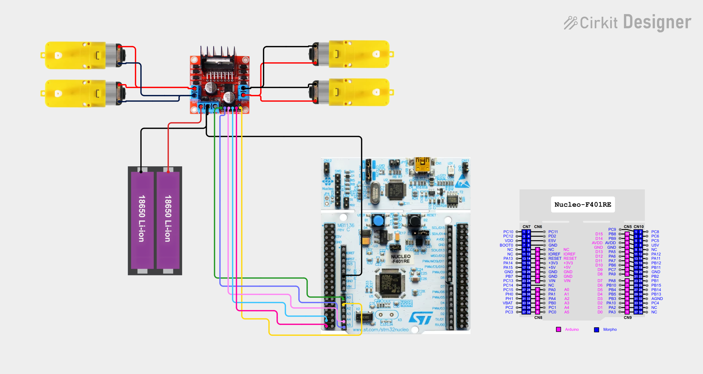

# AI CCTV - 자율주행 로봇 연동형 방재 시스템 ​

---

## 1. 프로젝트 개요 및 담당 역할

### 1-1) 프로젝트 개요
한화비전 AI CCTV로 위험 상황을 실시간으로 감지하고, 영상에서 좌표를 추출하여 해당 위치까지 ROS 기반의 자율주행 로봇이 이동 및 개입하여 사고를 방지한다. 

### 1-2) 역할: BSP 드라이버 개발

- 로봇 주행을 위한 하드웨어 최하위 계층 담당 
- STM 보드(MCU)에서 모터 및 센서 제어 드라이버 작성 
- RPi(ROS)와 STM 보드 간의 시리얼 통신 프로토콜 설계 및 구현

---

## 2. 하드웨어 회로 구성 

| 항목      | 내용         | STM보드 제어 방식 | 
| :-------- | :----------------------------------------- | :------ | 
| 모터 제어 | L298N 모터드라이버를 통해 로봇 바퀴의 DC모터 제어  | PWM과 GPIO 신호로 회전 속력과 방향 제어 |
| 휠 엔코더 | 좌/우 바퀴 회전 속력과 방향 측정  | 타이머 Encoder 모드 | 
| IMU 센서 | MPU6050 6축 센서의 가속도계와 자이로스코프로 로봇 몸체의 기울기와 회전을 측정하여 바닥면에 따라 오차가 발생할 수 있는 엔코더를 보조  | I2C 시리얼 통신 | 
| RPi↔STM32 통신 | STM32에서 RPi로 센서 데이터를 송신하고 모터 제어 명령을 수신 명령 | UART 시리얼 통신 | 

---

## 3. 하드웨어 구성 및 데이터 흐름도


---

## 4. 구현 결과 - RPi와 STM 보드 간의 UART 시리얼 통신 
### 4-1) 핀 연결 
| Raspberry Pi | STM32 (NUCLEO-F401RE) |
|---|---|
| GPIO 14 (TX, Phy 8) | PA10 (USART1_RX) |
| GPIO 15 (RX, Phy 10) | PA9 (USART1_TX) |
| GND | GND |
- 점프선으로 각 보드의 TX와 RX 핀을 교차하여 연결 

### 4-2) 패킷 구조

```
[HEADER1] [HEADER2] [CMD] [LEN] [DATA...] [CHECKSUM]
  0xFF      0xFE    (1B)   (1B)   (1B)       (1B)
```
| 필드 | 크기 | 설명 |
|------|------|------|
| HEADER | 2 byte | 패킷 시작 신호로 값은 `0xFF 0xFE`로 고정 |
| CMD | 1 byte | 모터 제어 또는 센서 데이터 전송에 대한 명령 종류 |
| LEN | 1 byte | DATA 필드 길이 (0~12) |
| DATA | 0~12 byte | 바퀴 속도 값 또는 센서 데이터 |
| CHECKSUM | 1 byte | `CMD ^ LEN ^ DATA[0] ^ DATA[1] ^ ...` (XOR) |

### 4-3) RPi → STM32: 모터 제어 명령 

| CMD  | Value | LEN | DATA | 설명 |
|--------------|------|-----|------|------|
| CMD_VELOCITY | `0x01` | 4 | `[vL_low, vL_high, vR_low, vR_high]` | 좌/우 바퀴 속도 [mm/s] (int16_t × 2) |
| CMD_STOP | `0x02` | 0 | 없음 | Soft Stop |
| CMD_ESTOP | `0x03` | 0 | 없음 | Emergency Stop |
| CMD_RELEASE| `0x04`  | 0 | 없음 | Emergency Stop Release |

- 속도 범위: -600 ~ +600 (int16_t 타입, mm/s 단위)

### 4-4) STM32 → RPi: 휠 엔코더와 IMU 센서 데이터 전송

| CMD | Value | LEN | DATA | 설명 |
|-----|------|-----|------|------|
| RSP_ODOM | `0x81` | 4 | `[encL_low, encL_high, encR_low, encR_high]` | 엔코더 카운트 (int16_t × 2) |
| RSP_IMU | `0x82` | 12 | `[ax(2B), ay(2B), az(2B), gx(2B), gy(2B), gz(2B)]` | IMU 6축 raw 데이터 (int16_t × 6) |
- 현재 코드에서는 20ms 주기로 전송
---

## 5. 구현 결과 - 모터 제어 
### 5-1) 모터 제어 회로 
- 

### 5-2) 핀 연결 
| **부품** | **부품핀** | **STM32 핀** | **Peripheral 설정** | 설명 |
| --- | --- | --- | --- | --- |
| 모터드라이버 (L298N) | ENA | PA0 | TIM2_CH1 (PWM Generation) | 왼쪽 속도 |
|  | ENB | PA1 | TIM2_CH2 (PWM Generation) | 오른쪽 속도 |
|  | IN1 | PC0 | GPIO_Output | 왼쪽 방향 1 |
|  | IN2 | PC1 | GPIO_Output | 왼쪽 방향 2 |
|  | IN3 | PC2 | GPIO_Output | 오른쪽 방향 1 |
|  | IN4 | PC3 | GPIO_Output | 오른쪽 방향 2 |
- PWM 신호로 모터의 회전 속력, 2개의 GPIO 핀을 이용해 모터의 회전 방향과 정지 상태를 제어
---

## 6. 구현 결과 - 휠 엔코더 센서 제어 

### 6-1) 쿼드러처 엔코더 동작 원리
```
정방향 회전:
  ──┐  ┌──┐  ┌──  : A상
    └──┘  └──┘
──┐  ┌──┐  ┌──    : B상
  └──┘  └──┘  
  A가 B보다 앞섬 → 카운트 증가

역방향 회전:
──┐  ┌──┐  ┌──    : A상
  └──┘  └──┘
  ──┐  ┌──┐  ┌──  : B상
    └──┘  └──┘
  B가 A보다 앞섬 → 카운트 감소
```
- 쿼드러처 엔코더는 모터 회전에 대하여 사각파 펄스의 A상, B상 두 신호를 출력하며 물리적으로 90도의 위상차가 발생하도록 엔코더가 물리적으로 구성
- MCU는 이를 입력으로 받아 두 신호의 위상차를 이용해 회전 방향을, 펄스를 카운트하여 회전 속력을 계산 

### 6-2) 핀 연결

| 엔코더 | 출력 | STM32 핀 | 타이머 |
|--------|------|----------|--------|
| 왼쪽 바퀴 | A상 | PA6 | TIM3_CH1 | 
|  | B상 | PA7 | TIM3_CH2 |
| 오른쪽 바퀴 | A상 | PB6 | TIM4_CH1 |
|  | B상 | PB7 | TIM4_CH2 |

### 6-3) STM 보드 핀 Peripheral 설정 
- 타이머를 Encoder Mode로 설정하면, 전진시에는 카운트가 증가하고 후진시에는 카운트가 감소
- 특정 시간 구간의 카운트 값의 차를 구하여 음수/양수 여부에 따라 회전 방향을, 값의 크기에 따라 회전 속력을 계산 

---

## 7. 구현 결과 - IMU 센서 제어 
### 7-1) MPU6050 칩
- MPU6050은 3축 가속도계 + 3축 자이로스코프가 통합된 6축 IMU 센서
- 로봇의 몸체의 움직임에 대하여 가속도계로 기울어짐을, 자이로스코프로 회전 상태를 측정 
- STM 보드와는 I2C 통신
- 센서의 레지스터에 적절한 값을 작성하여 측정을 시작하고, 데이터 레지스터에서 값을 읽어옴

### 7-2) 핀 연결

| MPU6050 (GY-521) | STM32 (NUCLEO-F401RE) | 설명 |
|---|---|---|
| VCC | 3.3V | 전원 |
| GND | GND | 접지 |
| SCL | PB8 | I2C1 클락 |
| SDA | PB9 | I2C1 데이터 |

---

## 8. 개발 일정표와 구현 현황 비교

### 8-1) 기존 개발 일정표

| 주차 | 기간 | 계획 항목 |
|------|------|-----------|
| 1주차 | 02/02 ~ 02/09 | Arduino 하드웨어 프로토타입 |
| 2주차 | 02/09 ~ 02/16 | Arduino 안정화 및 인터페이스 고정 |
| 3주차 | 02/16 ~ 02/23 | STM32 환경 구축 및 코드 이식 |
| 4주차 | 02/23 ~ 03/02 | STM32 성능 최적화 (Bare-metal) |
| 5주차 | 03/02 ~ 03/09 | RTOS 도입 및 태스크 구조 설계 |
| 6주차 | 03/09 ~ 03/16 | RTOS 기반 성능 극대화 |
| 7주차 | 03/16 ~ 03/23 | 상위 시스템 연동 안정화 |
| 8주차 | 03/23 ~ 03/30 | 최종 최적화 및 문서화 |

### 8-2) 실제 진행 현황 (2주차 기준)

Arduino 프로토타입 단계를 생략하고 STM32 보드로 바로 개발을 시작하여, 기존 1~4주차 계획 범위의 핵심 기능을 2주 만에 구현하였다.

| 기존 계획 | 실제 진행 | 비고 |
|-----------|-----------|------|
| 1~2주차: Arduino 프로토타입 및 안정화 | **생략** | STM32로 직접 개발 착수 |
| 3주차: STM32 환경 구축 및 코드 이식 | **완료** | 환경 구축, 모터/엔코더/IMU 드라이버 구현 |
| 4주차: STM32 성능 최적화 (Bare-metal) | **부분 완료** | UART 프로토콜, 모터 안전 기능(타임아웃, 비상정지) 구현. PID 제어는 미구현 |
| 5~6주차: RTOS 도입 | 미착수 | 향후 검토 |
| 7주차: 상위 시스템 연동 안정화 | **부분 진행** | RPi↔STM32 통신 및 센서 데이터 송신 동작 중 |
| 8주차: 최종 최적화 및 문서화 | 미착수 | — |

### 8-3) 2주간 구현 완료 항목

- 모터 제어: L298N 드라이버 추상화, PWM 속도 제어, 방향 제어, 가속도 제한, 명령 타임아웃(500ms), 비상 정지/해제
- UART 프로토콜: 바이너리 패킷 설계 및 구현, 인터럽트 기반 상태머신 파싱, 4종 명령 처리
- 휠 엔코더: TIM3/TIM4 Encoder 모드로 좌/우 바퀴 tick 카운트 읽기
- IMU 센서: MPU6050 I2C 통신, 6축 raw 데이터 읽기
- 센서 데이터 송신: 엔코더/IMU 데이터를 20ms 주기로 RPi에 패킷 전송

---

## 9. 추가 구현 계획

기존 일정표 대비 Arduino 단계를 생략하여 확보한 시간을 활용하여, 아래 항목을 추가로 구현할 계획이다.

### 9-1) 센서 데이터 검증 및 파라미터 보정
- 엔코더 tick 측정 정확도를 실측으로 검증 (일정 거리 주행 후 실제 이동 거리와 비교)
- ROS 파라미터 세팅: 바퀴 유효 지름(`wheel_radius`), 좌우 바퀴 중심 사이 거리(`wheel_base`)를 `param.yaml`에 설정
- ROS에서 엔코더 tick과 바퀴 지름, 분해능을 이용한 이동 거리 변환이 정확한지 확인

### 9-2) PID 속도 제어 구현
- 현재 RPi → STM32로 목표 속도를 mm/s 단위로 전송하지만, 엔코더 피드백 기반의 폐루프 제어가 없음
- STM32에서 엔코더 피드백을 이용한 PID 속도 제어기 구현
- 바퀴 지름 등 물리 파라미터를 STM32에 하드코딩하여 tick → 실제 속도 변환

### 9-3) 데이터 전송 안정성 개선
- 엔코더 tick 값을 int16_t로 전송 중이므로 장시간 회전 시 오버플로우 발생 가능 → ROS 측에서 오버플로우 보정 코드 필요
- 엔코더 데이터의 시간 정밀도: tick 값 간의 시간차를 알아야 정확한 속력 계산이 가능하며, 현재는 ROS가 데이터 수신 시점의 시간을 사용

### 9-4) 카메라 드라이버 확장
- 현재 카메라 영상 송출은 가능하나, 줌/적외선 센서 컷/Pan-Tilt 제어 기능은 미구현

---
