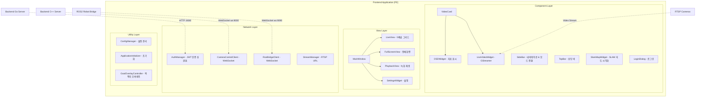

# Frontend Application - 재난 대응 자율주행 로봇 제어 시스템

**Qt 6 (C++)** + **GStreamer** 기반의 고성능 CCTV 관제 및 ROS2 로봇 제어 통합 시스템

산업 안전 재난 대응을 위한 데스크톱 애플리케이션으로, 다수의 RTSP 카메라 스트림을 실시간 모니터링하고 ROS2 기반 자율주행 로봇을 원격 제어합니다.

---

## ✨ 핵심 기능

### 🔐 JWT 기반 사용자 인증
- **로그인 다이얼로그**: Go 인증 서버(`/login`)와 연동한 JWT 토큰 발급
- **자동 토큰 갱신**: Access 토큰 만료 전 자동 Refresh
- **사용자 등록 / 비밀번호 재설정**: `AuthManager` 싱글톤으로 세션 관리
- **세션 만료 처리**: 토큰 무효화 시 자동으로 로그인 화면 복귀

### 📹 다채널 실시간 영상 관제 (Live View)
- **4분할 CCTV 그리드 + 로봇 카메라**: 총 5채널 동시 스트리밍
- **스마트 줌 & 팬**: 더블클릭 전체화면, 마우스 휠 줌, 드래그 팬, Shift+드래그 사각형 줌
- **RTSP Auto-Reconnect**: 서버 다운 시 3초 간격 무한 자동 재연결 (`RtspPinger`)
- **녹화 제어 & 다운로드**: 채널별 원격 녹화, 로컬 다운로드 및 재생
- **FRUC (Frame Rate Up-Conversion)**: OpenCV 기반 프레임 보간 (선택적 기능)

### 📊 실시간 OSD 성능 지표 오버레이
- **5가지 지표**: Packet Loss · Jitter · FPS · Bitrate · Latency
- **팝업 메뉴 제어**: 채널별 지표 개별 On/Off, 전체 일괄 전환
- **즉시 요청 방식**: 지표 체크 시 서버에 자동 요청 전송
- **듀얼 소스**: GStreamer 내부 통계 + WebSocket 서버 수신값 하이브리드

### 🗺 SLAM 지도 시각화 (`SlamMapWidget`)
- **실시간 지도**: ROS2 `/map` 토픽 수신 및 렌더링
- **로봇 위치 표시**: `/odom` 기반 실시간 위치 추적
- **경로 시각화**: Nav2 경로 표시
- **목적지 설정**: SLAM 지도 위 클릭/드래그로 자율주행 목적지 지정
- **순찰 경로 편집**: 다중 웨이포인트 지정 및 루프 순찰 설정

### 🤖 ROS2 로봇 원격 제어
- **수동 주행 (WASD)**: 키보드 제어로 10Hz 주기 `cmd_vel` 발행
- **카메라 틸트 (T/G)**: 카메라 상하 각도 제어
- **자율 주행**: 영상 또는 SLAM 지도에서 목적지 드래그로 `navigate_to_pose` 발행
- **모드 전환**: 수동 / 자율 / 인물추종 / 순찰 모드
- **비상 정지**: 원클릭 긴급 정지 발행
- **동적 IP 설정**: 앱 재시작 없이 ROS2 브리지 주소 변경

### 🚨 낙상 감지 알림
- **실시간 알림 패널**: ROS2 `/fall_detection/alert` 토픽 수신 시 UI 팝업 표시
- **자동 해제**: 일정 시간 후 알림 자동 숨김

### 🎨 시스템 설정 & 테마
- **설정 관리**: `settings.ini` 기반 영구 저장
- **다크/라이트 테마**: 실시간 토글, QSS 스타일시트 분리 (`style/theme_dark.qss`, `style/theme_light.qss`)
- **사용자 정의**: 카메라 IP·포트, ROS2 주소, 인증 서버 주소, 제어 권한 등

---

## 🏗 시스템 아키텍처

### 전체 구조도



### 모듈별 상세 구조

```
FE/
├── main.cpp                          # 앱 진입점, GStreamer 전역 초기화
├── mainwindow.cpp/.h                 # 메인 윈도우 컨트롤러
├── mainwindow_ui.cpp                 # UI 초기화 및 레이아웃
├── mainwindow_session.cpp            # 세션/인증 관련 로직 분리
├── CMakeLists.txt                    # 빌드 구성, GStreamer/OpenCV 링킹
├── resources.qrc                     # Qt 리소스 (폰트, 아이콘)
│
├── assets/                           # 정적 자산
│   ├── fonts/                        # Pretendard 폰트
│   └── icons/                        # 앱 아이콘
│
├── style/                            # QSS 스타일시트
│   ├── app_styles.qss                # 공통 스타일
│   ├── theme_dark.qss                # 다크 테마
│   ├── theme_light.qss               # 라이트 테마
│   └── icons/                        # 스타일 전용 아이콘 (SVG)
│
├── Views/                            # 화면 관리
│   ├── liveview.cpp/.h               # 5채널 CCTV 분할 그리드
│   ├── fullscreenview.cpp/.h         # 전체화면 뷰 (줌, 목표 설정)
│   └── playbackview.cpp/.h           # 녹화 재생 및 다운로드
│
├── Components/                       # UI 컴포넌트
│   ├── videocard.cpp/.h              # 개별 영상 카드 래퍼
│   ├── slammapwidget.cpp/.h          # SLAM 지도 시각화 (지도/오도메트리/경로)
│   ├── osdwidget.cpp/.h              # 실시간 지표 오버레이
│   ├── sidebar.cpp/.h                # 좌측 내비게이션 (모드 전환)
│   ├── topbar.cpp/.h                 # 상단 바 (로고, 시간, 사용자 정보)
│   ├── settingswidget.cpp/.h         # 설정 다이얼로그
│   ├── logindialog.cpp/.h            # 로그인 다이얼로그
│   └── full_underbar.cpp/.h          # 전체화면 하단 컨트롤 바
│
├── Video/                            # 영상 처리
│   ├── videowidget.cpp/.h            # GStreamer 파이프라인 베이스
│   ├── livevideowidget.cpp/.h        # RTSP 라이브 스트리밍
│   ├── recordedvideowidget.cpp/.h    # 로컬 파일 재생
│   ├── rtsppinger.cpp/.h             # RTSP 서버 상태 모니터 (재연결)
│   ├── frucvideoprocessor.cpp/.h     # FRUC 프레임 보간 (OpenCV, 선택적)
│   └── Gst/                          # GStreamer 전용 모듈
│       ├── GstQualityMonitor.cpp/.hpp
│       └── GstStatsCollector.hpp
│
├── Network/                          # 네트워크 통신
│   ├── authmanager.cpp/.h            # JWT 인증 매니저 (싱글톤)
│   ├── cameracontrolclient.cpp/.h    # 카메라 서버 WebSocket
│   ├── rosbridgeclient.cpp/.h        # ROS2 rosbridge WebSocket
│   └── streammanager.cpp/.h          # RTSP URL 생성기
│
└── Utils/                            # 유틸리티
    ├── configmanager.h               # 설정 관리 싱글톤 (settings.ini)
    ├── applicationinitializer.cpp/.h # 시스템 초기화 (GStreamer, 폰트)
    ├── channelcatalog.cpp/.h         # 채널 URL 카탈로그 관리
    ├── goaloverlaycontroller.cpp/.h  # 목적지 화살표 오버레이 컨트롤러
    ├── framelessconfirmdialog.cpp/.h # 프레임리스 확인 다이얼로그
    ├── jsonutils.cpp/.h              # JSON 직렬화 유틸리티
    └── constants.h                   # 전역 상수 정의
```

---

## 🛠 기술 스택 및 요구사항

### 시스템 요구사항

| 항목 | 요구사항 |
|------|-----------|
| **OS** | Windows 10/11 (64-bit) |
| **컴파일러** | MSVC 2019+ 또는 MinGW 64-bit |
| **Qt** | Qt 6.x (Widgets, WebSockets, Network 모듈) |
| **CMake** | 3.16 이상 |
| **GStreamer** | 1.16+ MSVC 64-bit (Runtime + Development) |
| **OpenCV** | 4.x (FRUC 기능 사용 시) |

### 라이브러리 의존성

| 라이브러리 | 용도 | 버전 |
|------------|------|------|
| **Qt6 Core** | 기본 프레임워크 | 6.x |
| **Qt6 Widgets** | GUI 컴포넌트 | 6.x |
| **Qt6 WebSockets** | ROS2 브리지, 카메라 제어 | 6.x |
| **Qt6 Network** | HTTP 통신 | 6.x |
| **GStreamer** | 영상 파이프라인 | 1.16+ |
| **OpenCV** | 영상 처리 (선택적) | 4.x |

---

## 🚀 빌드 및 실행

### 1. 환경 설정

#### GStreamer 설치
1. [GStreamer 다운로드 페이지](https://gstreamer.freedesktop.org/download/)에서 MSVC 64-bit 버전 다운로드
2. **Runtime** + **Development** 패키지 모두 설치
3. 환경 변수 확인:
   ```bash
   GSTREAMER_1_0_ROOT_MSVC_X86_64=C:\gstreamer\1.0\msvc_x86_64
   ```

#### Qt 6 설치
1. Qt Online Installer에서 Qt 6.x MSVC 64-bit 설치
2. 필요 모듈: Widgets, WebSockets, Network

### 2. 프로젝트 빌드

```bash
# 1. 저장소 클론
git clone https://github.com/geunumhanjio/Final_Project.git
cd Final_Project/FE

# 2. Qt Creator로 빌드 (권장)
# - Qt Creator에서 CMakeLists.txt 열기
# - 키트 선택: Desktop Qt 6.x.x MSVC 64bit
# - 빌드 후 실행

# 3. 명령줄 빌드 (고급)
mkdir build && cd build
cmake .. -G "Visual Studio 16 2019" -A x64
cmake --build . --config Release
```

### 3. 실행 및 초기 설정

```bash
# 빌드된 실행 파일 경로에서
./VEDA_QT_1.exe

# 또는 Qt Creator에서 직접 실행 (Run 버튼)
```

#### 첫 실행 시 로그인 및 설정
1. **로그인**: Go 인증 서버 주소(기본 `http://localhost:8080`)와 계정 입력
2. **설정 > 네트워크**:
   - 카메라 서버 주소: `192.168.0.39:8554`
   - ROS2 브리지 주소: `ws://192.168.0.237:9090`
3. **설정 > 제어**: 수동 제어 허용 체크 시 WASD 키로 로봇 제어 가능

---

## 📋 사용 방법

### 기본 인터페이스

#### 1. 라이브 뷰 (Live View)
- **5채널 그리드**: 고정 CCTV 카메라 4개 + 로봇 탑재 카메라
- **지표 표시**: 각 채널의 톱니바퀴 버튼 → 지표 선택
- **녹화 제어**: 우클릭 → 녹화 시작/정지

#### 2. 전체화면 뷰 (Full Screen)
- **접근**: 채널 더블클릭
- **줌 제어**: 마우스 휠 (확대/축소)
- **팬 제어**: 마우스 드래그
- **사각형 줌**: Shift + 드래그
- **목적지 설정**: 자율 모드에서 마우스 드래그 (빨간 화살표 표시)

#### 3. SLAM 지도 뷰
- **지도 확인**: 사이드바에서 SLAM 지도 탭 접근
- **목적지 설정**: 지도 위 드래그로 자율주행 목적지 지정
- **순찰 경로**: 다중 포인트 클릭 → 루프 순찰 경로 등록

#### 4. 로봇 제어

##### 수동 모드 (Manual Mode)
```
W: 전진       A: 좌회전
S: 후진       D: 우회전
T: 카메라 위  G: 카메라 아래
```
- **속도**: 키 조합으로 차등 속도 가능
- **정지**: 키에서 손을 떼면 자동 정지
- **비상정지**: 사이드바의 빨간 버튼

##### 자율 모드 (Autonomous Mode)
1. 사이드바에서 **Autonomous** 선택
2. 전체화면 또는 SLAM 지도에서 **목적지 드래그** (시작점 → 끝점)
3. 빨간 화살표로 방향 확인 후 자동 이동

##### 순찰 모드 (Patrol Mode)
1. 사이드바에서 **Patrol** 선택
2. SLAM 지도에서 순찰 포인트를 순서대로 클릭
3. 경로 확정 후 루프 순찰 시작

#### 5. 설정 (Settings)
- **네트워크**: 카메라 IP·포트, 인증 서버 주소, ROS2 브리지 주소
- **제어**: 수동 제어 허용 여부
- **테마**: 다크/라이트 모드 전환
- **보안**: RTSPS (암호화 RTSP) 사용 여부

---

## 🔧 설정 파일 구조

### settings.ini
```ini
[Network]
CameraIP=192.168.0.39
CameraPort=8554
RobotIP=ws://192.168.0.237:9090
UseCustomCCTV=false
UseRtsps=false

[Control]
ManualControl=true
```

### 주요 설정 항목
| 키 | 기본값 | 설명 |
|---|--------|------|
| `CameraIP` | `192.168.0.39` | CCTV 서버 IP 주소 |
| `CameraPort` | `8554` | RTSP 서버 포트 |
| `RobotIP` | `ws://192.168.0.237:9090` | ROS2 WebSocket 브리지 주소 |
| `UseCustomCCTV` | `false` | 외부 CCTV 사용 여부 |
| `UseRtsps` | `false` | 암호화 RTSP 사용 |
| `ManualControl` | `true` | WASD 수동 제어 허용 |

---

## 🔌 네트워크 프로토콜

### WebSocket 통신

#### 1. ROS2 Bridge (rosbridge_server)
**연결**: `ws://192.168.0.237:9090`

**명령 속도 제어**:
```json
{
  "op": "publish",
  "topic": "/cmd_vel",
  "msg": {
    "linear": {"x": 0.5, "y": 0, "z": 0},
    "angular": {"x": 0, "y": 0, "z": 0.3}
  }
}
```

**목적지 설정**:
```json
{
  "op": "call_service",
  "service": "/navigate_to_pose",
  "args": {
    "pose": {
      "position": {"x": 2.0, "y": 1.0, "z": 0},
      "orientation": {"x": 0, "y": 0, "z": 0.707, "w": 0.707}
    }
  }
}
```

#### 2. Camera Control Server
**연결**: `ws://192.168.0.39:9000`

**스트림 통계 요청**:
```json
{
  "type": "REQUEST_STREAM_STATS",
  "payload": {
    "channel_id": 1,
    "action": "start"
  }
}
```

**녹화 제어**:
```json
{
  "type": "RECORD_CONTROL",
  "payload": {
    "action": "start",
    "channel": 1
  }
}
```

### RTSP 스트림 주소
```
rtsp://192.168.0.39:8554/channel1  # 고정 카메라 1
rtsp://192.168.0.39:8554/channel2  # 고정 카메라 2
rtsp://192.168.0.39:8554/channel3  # 고정 카메라 3
rtsp://192.168.0.39:8554/channel4  # 고정 카메라 4
rtsp://192.168.0.39:8554/robot     # 로봇 카메라
```

---

## 🎥 GStreamer 파이프라인

### 라이브 스트리밍 파이프라인
```bash
rtspsrc location=rtsp://server/stream 
  ! rtph264depay 
  ! avdec_h264 
  ! videoconvert 
  ! qtvideosink
```

### 녹화 파이프라인
```bash
rtspsrc location=rtsp://server/stream
  ! tee name=t
  ! queue ! rtph264depay ! avdec_h264 ! videoconvert ! qtvideosink
  t. ! queue ! rtph264depay ! avdec_h264 ! x264enc ! mp4mux ! filesink location=output.mp4
```

### 품질 모니터링
```cpp
// GStreamer 통계 수집
GstElement *rtpbin = gst_bin_get_by_name(GST_BIN(pipeline), "rtpbin");
g_object_get(rtpbin, "stats", &stats, NULL);

// Packet Loss 계산
guint packets_lost = g_value_get_uint(gst_structure_get_value(stats, "packets-lost"));
guint packets_received = g_value_get_uint(gst_structure_get_value(stats, "packets-received"));
double loss_rate = (double)packets_lost / (packets_received + packets_lost) * 100.0;
```

---

## 🔍 디버깅 및 문제 해결

### 자주 발생하는 문제

#### 1. GStreamer 관련
**"Could not load plugin 'xyz'"**
```bash
# 플러그인 확인
gst-inspect-1.0 --print-all | grep xyz

# 환경 변수 확인
echo $GST_PLUGIN_PATH
```

**해결방법**: CMakeLists.txt에서 올바른 GStreamer 경로 설정

#### 2. Qt 관련
**"Qt6 modules not found"**
- Qt Creator에서 올바른 키트 선택
- CMake 설정에서 Qt6 경로 확인

#### 3. 네트워크 연결
**"WebSocket connection failed"**
```cpp
// 로그 확인
qDebug() << "WebSocket error:" << socket.errorString();
```
- 서버 주소 및 포트 확인
- 방화벽 설정 확인

#### 4. RTSP 스트림 문제
**"Pipeline state change failed"**
- RTSP 서버 상태 확인
- 네트워크 연결 상태 확인
- 코덱 지원 여부 확인

### 로그 및 디버그 정보

#### Debug 빌드 시 상세 로그
```cpp
// main.cpp에서 디버그 레벨 설정
qputenv("GST_DEBUG", "3");  // GStreamer 디버그
qputenv("QT_LOGGING_RULES", "*.debug=true");  // Qt 디버그
```

#### GStreamer 파이프라인 디버그
```bash
# DOT 그래프 생성
export GST_DEBUG_DUMP_DOT_DIR=./debug
# 앱 실행 후 DOT 파일을 PNG로 변환
dot -Tpng debug/pipeline.dot -o pipeline.png
```

---

## 📈 성능 최적화

### 렌더링 성능
- **하드웨어 가속**: GPU 기반 디코딩 활용 (`vaapi`, `nvcodec`)
- **버퍼 관리**: 프레임 드롭으로 지연 시간 최소화
- **멀티스레딩**: 각 채널별 독립 스레드 처리

### 메모리 사용량
- **스마트 포인터**: 자동 메모리 관리
- **프레임 풀링**: 대용량 버퍼 재사용
- **지연 로딩**: 비활성 채널 리소스 해제

### 네트워크 대역폭
- **적응형 품질**: 네트워크 상태에 따른 해상도 조정
- **압축**: H.264/H.265 코덱 최적화
- **버퍼링**: 네트워크 지터 대응

---

## 🧪 테스트 방법

### 단위 테스트
```bash
# Qt Test 프레임워크 (계획 중)
cd build && ctest
```

### 통합 테스트
1. **RTSP 서버 Mock**: GStreamer `videotestsrc` 사용
2. **WebSocket Mock**: 로컬 테스트 서버 구축
3. **UI 테스트**: Qt Test 프레임워크

### 부하 테스트
- **다중 스트림**: 5채널 동시 재생
- **장시간 실행**: 24시간 연속 동작
- **메모리 누수**: Valgrind (Linux) 또는 Application Verifier (Windows)

---

## 🚀 배포 가이드

### Windows 배포 패키지 생성
```bash
# Qt 배포 도구 사용
windeployqt.exe --qmldir . VEDA_QT_1.exe

# GStreamer 라이브러리 포함
copy "C:\gstreamer\1.0\msvc_x86_64\bin\*.dll" ./
```

### 필요 파일 목록
- `VEDA_QT_1.exe`: 메인 실행 파일
- Qt6 DLL 파일들 (Core, Widgets, WebSockets, Network)
- GStreamer 라이브러리 및 플러그인
- Visual C++ 재배포 가능 패키지
- `settings.ini`: 기본 설정 파일

---

## 🤝 개발 가이드

### 코딩 규칙
- **Qt 스타일**: Qt Coding Style 준수
- **변수명**: camelCase (함수), snake_case (변수)
- **헤더**: `#pragma once` 사용
- **포인터**: 스마트 포인터 우선 사용

### 브랜치 전략
- **main**: 안정화 브랜치
- **develop**: 개발 브랜치  
- **feature/기능명**: 기능 개발 브랜치

### 커밋 메시지
```
:sparkles: [Feat] 새 기능 추가
:bug: [Fix] 버그 수정
:memo: [Docs] 문서 수정
:art: [Style] 코드 스타일 개선
:recycle: [Refactor] 코드 리팩토링
```

---

## 📚 참고 자료

### 공식 문서
- [Qt 6 Documentation](https://doc.qt.io/qt-6/)
- [GStreamer Documentation](https://gstreamer.freedesktop.org/documentation/)
- [ROS2 Documentation](https://docs.ros.org/en/humble/)

### 개발 도구
- **Qt Creator**: 통합 개발 환경
- **CMake**: 빌드 시스템
- **Git**: 버전 관리

---

**개발팀**: VEDA AIoT 프로젝트 (근엄한조)  
**라이선스**: MIT License  
**최종 업데이트**: 2026-04-02