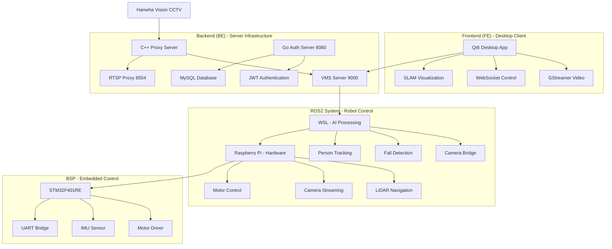

# VEDA 재난 대응 자율주행 로봇 시스템 - 근엄한조

**산업 안전 재난 대응을 위한 AI 기반 통합 로봇 시스템**

이 프로젝트는 Hanwha Vision AI CCTV와 연동된 자율주행 로봇을 통해 재난 상황을 실시간으로 감지하고 대응하는 통합 시스템입니다.

---

## 🚀 시스템 아키텍처



---

## 🔧 시스템 구성요소

### [Backend (BE)](./BE/README.md) - 서버 인프라
하이브리드 백엔드 아키텍처로 C++ 미디어 처리 엔진과 Go 인증 서비스로 구성
- **C++ Proxy Server**: RTSP 스트림 중계, 영상 품질 모니터링, ROS2 연동
- **Go Auth Service**: JWT 기반 인증, 사용자 관리, MySQL 데이터베이스

**기술 스택**: GStreamer, OpenCV, Boost.Beast, Gin, MySQL

### [Frontend (FE)](./FE/README.md) - 데스크톱 클라이언트  
Qt6 기반 크로스플랫폼 CCTV 모니터링 및 로봇 제어 애플리케이션
- **실시간 영상**: 다채널 CCTV 스트림 모니터링
- **로봇 제어**: WebSocket 기반 원격 제어 인터페이스
- **SLAM 시각화**: 실시간 지도 및 로봇 위치 표시

**기술 스택**: Qt6, GStreamer, WebSocket, QML

### [BSP (Board Support Package)](./BSP/README.md) - 임베디드 제어
STM32F401RE 기반 로봇 하드웨어 제어 시스템
- **모터 제어**: L298N 드라이버 기반 차동구동 제어
- **센서 처리**: MPU6050 IMU 데이터 수집
- **통신 브릿지**: UART 프로토콜 기반 ROS2 연동

**기술 스택**: STM32 HAL, CMSIS, FreeRTOS

### [ROS2 System](./ros/README.md) - 로봇 자율주행
분산 ROS2 아키텍처로 WSL과 Raspberry Pi 간 역할 분담
- **WSL**: AI 처리, 낙상 감지, 사람 추적, 경로 계획
- **Raspberry Pi**: 실시간 하드웨어 제어, LiDAR SLAM, 카메라 스트리밍

**기술 스택**: ROS2 Humble, MediaPipe, YDLiDAR, OpenCV

---

## 🎯 핵심 기능

### 재난 감지 및 대응
- **AI 기반 낙상 감지**: MediaPipe를 활용한 실시간 낙상 상황 탐지
- **자동 출동**: CCTV에서 감지된 위험 좌표로 로봇 자동 이동
- **실시간 모니터링**: 다채널 CCTV 통합 관제 시스템

### 자율주행 및 내비게이션
- **SLAM 맵핑**: YDLiDAR X4 기반 실시간 지도 생성
- **경로 계획**: Nav2 기반 최적 경로 탐색 및 장애물 회피
- **정밀 제어**: PID 기반 모터 제어로 안정적인 주행 성능

### 통합 관제 시스템
- **웹 기반 인증**: JWT 토큰 기반 보안 시스템
- **실시간 영상 전송**: RTSP 프록시를 통한 저지연 스트리밍
- **원격 제어**: WebSocket 기반 실시간 로봇 제어

---

## 🛠 개발 환경 설정

### 시스템 요구사항
- **OS**: Ubuntu 20.04+ (WSL2), Windows 10+ (Desktop)
- **하드웨어**: Raspberry Pi 4, STM32F401RE, YDLiDAR X4
- **컴파일러**: GCC 9+, MSVC 2019+, Go 1.22+

### 의존성 설치

#### Ubuntu (WSL2/Native)
```bash
# ROS2 Humble
sudo apt update
sudo apt install software-properties-common
sudo add-apt-repository universe
sudo apt update && sudo apt install curl -y
sudo curl -sSL https://raw.githubusercontent.com/ros/rosdistro/master/ros.asc | sudo apt-key add -
sudo sh -c 'echo "deb http://packages.ros.org/ros2/ubuntu $(lsb_release -cs) main" > /etc/apt/sources.list.d/ros2-latest.list'
sudo apt update
sudo apt install ros-humble-desktop python3-argcomplete -y

# Backend Dependencies
sudo apt install libgstreamer1.0-dev libgstreamer-plugins-base1.0-dev \
                 libopencv-dev libboost-all-dev libssl-dev cmake build-essential \
                 mysql-server mysql-client libmysqlclient-dev
```

#### Windows (Frontend)
```bash
# Qt6 and GStreamer (using vcpkg)
git clone https://github.com/Microsoft/vcpkg.git
cd vcpkg && .\bootstrap-vcpkg.bat
.\vcpkg integrate install
.\vcpkg install qt6 gstreamer
```

### 빌드 순서

#### 1. Backend 빌드
```bash
cd BE/
mkdir build && cd build
cmake .. && make -j$(nproc)

cd ../login/
go mod download && go build -o login-server ./cmd/server
```

#### 2. Frontend 빌드  
```bash
cd FE/
mkdir build && cd build
cmake .. && make -j$(nproc)
```

#### 3. BSP 빌드
```bash
cd BSP/
make clean && make
# 또는 STM32CubeIDE에서 빌드
```

#### 4. ROS2 빌드
```bash
# WSL (Docker 컨테이너 내부)
cd ros/WSL/docker && docker compose up -d
docker exec -it wsl_ros2 bash
cd /root/ros2_ws && colcon build --symlink-install
source install/setup.bash

# Raspberry Pi (Docker 컨테이너 내부)
cd ros/rsvp/docker && docker compose up -d
docker exec -it rpi_ros2 bash
cd /root/ros2_ws && colcon build --symlink-install
source install/setup.bash
```

---

## 🚀 시스템 실행

### 1. 인프라 준비
```bash
# MySQL 데이터베이스 설정 (기본 DB명: login_server)
sudo mysql -u root -p
CREATE DATABASE login_server CHARACTER SET utf8mb4;
CREATE USER 'rokgeun'@'localhost' IDENTIFIED BY 'secure_password';
GRANT ALL PRIVILEGES ON login_server.* TO 'rokgeun'@'localhost';

# Go 인증 서버 환경 변수 설정
export JWT_SECRET="your-secret-key-here"
export MYSQL_HOST="localhost"
export MYSQL_DATABASE="login_server"
export MYSQL_USER="rokgeun"
export MYSQL_PASSWORD="secure_password"
```

### 2. 서버 시작 순서

#### Backend 서비스
```bash
# 1. Go 인증 서버 (포트 8080)
cd BE/login/ && ./login-server &

# 2. C++ 미디어 서버 (포트 8554, 9000)
cd BE/build/ && ./ProxyServer &
```

#### ROS2 시스템
```bash
# WSL - Docker 컨테이너에서 AI 처리 노드 실행
docker exec -it wsl_ros2 bash -c \
  "source /root/ros2_ws/install/setup.bash && \
   ros2 launch wsl_bringup wsl_bringup.launch.py"

# Raspberry Pi - Docker 컨테이너에서 하드웨어 제어 노드 실행
docker exec -it rpi_ros2 bash -c \
  "source /root/ros2_ws/install/setup.bash && \
   ros2 launch rpi_bringup rpi_bringup.launch.py"
```

#### Frontend 애플리케이션
```bash
cd FE/build/ && ./VEDA_QT_1.exe
```

### 3. 시스템 상태 확인
```bash
# 포트 사용 확인
netstat -tlnp | grep -E "(8080|8554|9000)"

# ROS2 노드 상태
ros2 node list
ros2 topic list

# 로그 모니터링
tail -f /var/log/veda-system.log
```

---

## 🔌 API 및 통신 규격

### Backend API (Port 8080)
```bash
# 헬스 체크
curl http://localhost:8080/healthz

# 로그인
curl -X POST http://localhost:8080/login \
     -H "Content-Type: application/json" \
     -d '{"id":"admin","password":"admin123"}'

# 사용자 관리
curl -X GET http://localhost:8080/users \
     -H "Authorization: Bearer YOUR_JWT_TOKEN"
```

### WebSocket 명령 (Port 9000)
```json
# 위험 좌표 전송
{
  "type": "COORDINATE_REPORT",
  "payload": {
    "x": 150.5, "y": 200.0,
    "confidence": 0.95, "camera_id": 1
  }
}

# 로봇 제어
{
  "type": "ROBOT_CONTROL", 
  "payload": {
    "action": "move", "x": 100, "y": 50
  }
}
```

### ROS2 토픽
```bash
# 주요 토픽 목록
/cmd_vel          # 로봇 속도 제어
/scan            # LiDAR 데이터
/map             # SLAM 지도
/camera/image    # 카메라 영상
/imu/data        # IMU 센서 데이터
```

---

## 🔧 설정 및 커스터마이징

### 네트워크 설정
```yaml
# BE 설정
rtsp_proxy:
  port: 8554
  channels: 4
  
vms_server:
  port: 9000
  ros_bridge: "192.168.0.237:9090"

# ROS2 설정  
dds_config:
  domain_id: 30
  discovery_peers:
    - "192.168.0.100"
    - "192.168.0.237"
```

### 로봇 파라미터
```yaml
# 물리적 파라미터
robot_specs:
  wheel_radius: 0.033    # 바퀴 반지름 (m)
  wheel_base: 0.16       # 축간거리 (m)
  max_velocity: 1.0      # 최대 속도 (m/s)

# PID 제어
motor_pid:
  kp: 2.0
  ki: 0.1  
  kd: 0.05
```

---

## 📊 모니터링 및 디버깅

### 로그 시스템
```bash
# 시스템 로그 확인
sudo journalctl -u veda-backend.service -f
sudo journalctl -u veda-ros2.service -f

# GStreamer 디버그
GST_DEBUG=3 ./ProxyServer

# ROS2 디버그 
ros2 run rqt_console rqt_console
ros2 run rqt_graph rqt_graph
```

### 성능 모니터링
```bash
# 시스템 리소스
top -p $(pgrep -f "ProxyServer|ros2")

# 네트워크 통계
ss -tuln | grep -E "(8080|8554|9000)"

# ROS2 통신 상태
ros2 topic hz /cmd_vel
ros2 topic echo /scan --once
```

---

## 🔒 보안 고려사항

### 네트워크 보안
- **JWT 토큰**: 15분 만료 Access 토큰 + 7일 Refresh 토큰
- **RTSPS 지원**: TLS 암호화 RTSP 스트리밍 (포트 8322)  
- **방화벽 설정**: 필수 포트만 개방 (8080, 8554, 9000)

### 시스템 보안
- **사용자 격리**: 전용 시스템 사용자 계정으로 실행
- **파일 권한**: 최소 권한 원칙 적용
- **로그 보안**: 민감 정보 로깅 금지

---

## 📈 성능 최적화

### 하드웨어 최적화
- **GPU 가속**: NVIDIA 환경에서 GStreamer nvcodec 활용
- **메모리 최적화**: 대용량 프레임 버퍼 풀링
- **실시간 처리**: PREEMPT_RT 커널 적용 권장

### 네트워크 최적화  
- **대역폭 제한**: RTSP 스트림 비트레이트 조절
- **버퍼링 최적화**: GStreamer 파이프라인 튜닝
- **연결 풀링**: MySQL 커넥션 풀 설정

---

## 🐛 문제 해결

### 자주 발생하는 문제

#### "ROS2 노드 연결 실패"
```bash
# DDS 설정 확인
echo $ROS_DOMAIN_ID  # 30이어야 함
export CYCLONEDDS_URI=file:///path/to/cyclonedx.xml

# 방화벽 설정  
sudo ufw allow 7400:7500/udp
sudo ufw allow 7400:7500/tcp
```

#### "RTSP 스트림 연결 안됨"
```bash
# GStreamer 플러그인 확인
gst-inspect-1.0 rtspsrc
gst-launch-1.0 rtspsrc location=rtsp://localhost:8554/channel1 ! fakesink

# 포트 사용 확인
sudo netstat -tlnp | grep 8554
```

#### "STM32 UART 통신 오류"
```bash
# 시리얼 포트 권한
sudo usermod -a -G dialout $USER
sudo chmod 666 /dev/ttyACM0

# 통신 테스트
minicom -D /dev/ttyACM0 -b 115200
```

---

## 🤝 개발 및 기여

### 개발 환경
```bash
# 개발 도구 설치
sudo apt install clang-format clang-tidy cppcheck
pip install pre-commit flake8 black

# Pre-commit 훅 설정
pre-commit install
```

### 코딩 스타일
- **C++**: Google C++ Style Guide
- **Go**: `gofmt`, `go vet` 적용
- **Python**: Black formatter, PEP8 준수
- **CMake**: Modern CMake (3.10+) 사용

### 브랜치 전략
```bash
# Feature 개발
git checkout -b feature/새기능명
git commit -m "feat: 새로운 기능 추가"
git push origin feature/새기능명

# 브랜치 병합
git checkout Release
git merge --no-ff feature/새기능명
```

---

## 📋 라이선스 및 크레딧

**프로젝트**: VEDA AIoT 프로젝트  
**팀명**: 근엄한조  
**라이선스**: MIT License  
**버전**: v1.0.0  

### 사용된 오픈소스
- **ROS2 Humble**: Apache 2.0 License
- **Qt6**: LGPL v3 License  
- **GStreamer**: LGPL v2 License
- **OpenCV**: Apache 2.0 License
- **Go Gin**: MIT License

---

## 📞 지원 및 문의

### 기술 지원
- **이슈 트래킹**: GitHub Issues
- **BSP 문서**: `BSP/docs/` 디렉터리 참조
- **ROS 패키지 문서**: `ros/WSL/src/*/README.md`, `ros/rsvp/ros2_ws/src/*/README.md`

### 팀 연락처  
- **프로젝트 리더**: [연락처]
- **백엔드 개발**: [연락처] 
- **프론트엔드 개발**: [연락처]
- **임베디드 개발**: [연락처]
- **로봇공학**: [연락처]

---

**최종 업데이트**: 2026년 4월 2일  
**문서 버전**: v1.0.0
