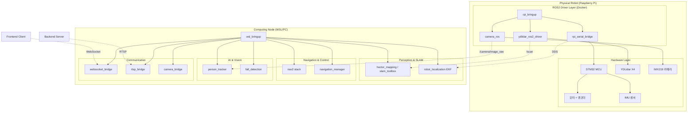

# ROS2 System - 재난 대응 자율주행 로봇 시스템

**ROS2 Humble 기반 CCTV-SLAM 순찰 로봇 소프트웨어 스택**

라즈베리파이(하드웨어 제어)와 WSL(고연산 처리)로 역할을 분리하여 운영하는 분산 ROS2 시스템입니다.

---

## 🚀 시스템 개요

### 아키텍처 철학

이 프로젝트는 **"적재적소의 컴퓨팅"** 원칙을 따라 설계되었습니다:

- **🔧 라즈베리파이**: 실시간 하드웨어 I/O (지연 시간 민감)
- **🧠 WSL/PC**: 고연산 소프트웨어 처리 (연산량 대, 지연 허용)

### 전체 시스템 구성도



---

## 📁 디렉터리 구조

### 전체 구조

```
ros/
├── rsvp/                       # 라즈베리파이 측 (실제 로봇 하드웨어)
│   ├── docker/                 # Docker 컨테이너 환경
│   │   ├── Dockerfile          # ARM64 + libcamera + YDLiDAR SDK
│   │   ├── docker-compose.yml  # 하드웨어 디바이스 마운트
│   │   ├── cyclonedx.xml       # CycloneDDS 피어 설정 (WSL 주소)
│   │   └── entrypoint.sh       # 컨테이너 시작 스크립트
│   └── ros2_ws/src/            # ROS2 워크스페이스
│       ├── rpi_bringup/        # RPi 전체 시스템 런처
│       ├── rpi_serial_bridge/  # STM32 시리얼 통신 & 오도메트리
│       ├── camera_ros/         # IMX219 카메라 드라이버 (libcamera)
│       └── ydlidar_ros2_driver/# YDLiDAR X4 드라이버
│
└── WSL/                        # PC/WSL 측 (고연산 처리)
    ├── docker/                 # Docker 컨테이너 환경
    │   ├── Dockerfile          # ROS2 Humble Desktop + Nav2
    │   ├── docker-compose.yml  # X11 포워딩 설정
    │   └── cyclonedx.xml       # CycloneDDS 피어 설정 (RPi 주소)
    ├── mediamtx.yml           # RTSP 미디어 서버 설정
    └── src/                    # ROS2 패키지들
        ├── wsl_bringup/        # WSL 전체 시스템 런처
        ├── camera_bridge/      # MJPEG → ROS2 토픽 변환
        ├── rtsp_bridge/        # ROS2 이미지 → RTSP 스트리밍
        ├── websocket_bridge/   # ROS2 ↔ WebSocket (클라이언트용)
        ├── robot_description/  # URDF 로봇 모델
        ├── robot_localization_config/ # EKF 센서 융합 설정
        ├── robot_navigation/   # SLAM / Navigation2 설정
        ├── hector_mapping/     # HectorSLAM (scan-only SLAM)
        ├── navigation_manager/ # 자율주행 미션 컨트롤러
        ├── person_tracker/     # MediaPipe 사람 추종 노드
        └── fall_detection/     # MediaPipe 낙상 감지 노드
```

---

## 🤔 시스템 분리의 이유

### 라즈베리파이 5의 한계

라즈베리파이 5는 상당한 성능을 보유하지만, **SLAM + Nav2 + EKF + 카메라 스트리밍을 동시 실행**하면 CPU 부하가 급격히 증가하여 실시간 하드웨어 제어에 악영향을 줍니다.

### 역할 분리 원칙

| 구분 | 라즈베리파이 (`rsvp/`) | WSL/PC (`WSL/`) |
|------|----------------------|-----------------|
| **핵심 역할** | 실시간 하드웨어 I/O | 고연산 소프트웨어 처리 |
| **담당 노드** | • 시리얼 브릿지 (STM32)<br>• 라이다 드라이버<br>• 카메라 드라이버 | • SLAM (HectorSLAM/SLAM Toolbox)<br>• Nav2 (경로계획, 장애물회피)<br>• EKF (센서 융합)<br>• RTSP/WebSocket 서버<br>• 사람 추종, 낙상 감지 |
| **특성** | 지연 시간 민감 (엔코더, IMU) | 연산량 큼, 지연 허용 가능 |
| **아키텍처** | ARM64 (aarch64) | x86_64 |
| **전용 하드웨어** | libcamera, YDLiDAR SDK, /dev/serial0 | RViz2 (X11), CUDA (가능한 경우) |

이 분리를 통해 라즈베리파이는 **안정적인 센서 데이터 퍼블리시**에 집중하고, 무거운 연산은 PC에서 처리합니다.

---

## 🐳 Docker 사용 이유

### 라즈베리파이 측 (`rsvp/docker/`)

**핵심 이유**: 의존성 충돌 방지와 재현 가능한 빌드

- **libcamera v0.3.0**: 라즈베리파이 전용 빌드 필요, 호스트 OS 라이브러리와 충돌 방지
- **YDLiDAR SDK**: C++ SDK 빌드 환경 격리
- **ARM64 패키지**: 팀원 간 동일한 환경 재현

```yaml
# rsvp/docker/docker-compose.yml 주요 설정
network_mode: host      # DDS UDP 멀티캐스트를 위해 필수
privileged: true        # udev 디바이스 접근
devices:
  - /dev/serial0        # STM32 UART
  - /dev/ttyUSB0        # YDLiDAR
  - /dev/video0         # IMX219 카메라
```

### WSL 측 (`WSL/docker/`)

**핵심 이유**: ROS2 Humble 환경 일관성과 GUI 지원

- **Nav2/SLAM Toolbox**: 복잡한 의존성 패키지들의 일관된 설치
- **X11 포워딩**: RViz2를 WSL 컨테이너에서 Windows로 출력
- **GStreamer**: RTSP 스트리밍에 필요한 플러그인 관리

```yaml
# WSL/docker/docker-compose.yml 주요 설정
network_mode: host
environment:
  - DISPLAY=127.0.0.1:0  # RViz2 X11 포워딩
volumes:
  - /tmp/.X11-unix:/tmp/.X11-unix:rw
```

---

## 🌐 DDS 네트워크 통신

### 네트워크 토폴로지

```
LAN (192.168.0.0/24)
  ├── 라즈베리파이  192.168.0.33   (하드웨어 센서 노드들)
  └── WSL PC       192.168.0.237  (고연산 처리 노드들)
```

### CycloneDDS 설정

**rsvp/docker/cyclonedx.xml** (RPi 측):
```xml
<NetworkInterface address="192.168.0.33"/>   <!-- 자신의 IP -->
<Peer address="192.168.0.237"/>              <!-- WSL의 IP -->
<AllowMulticast>true</AllowMulticast>
```

**WSL/docker/cyclonedx.xml** (WSL 측):
```xml
<NetworkInterface address="192.168.0.237"/>  <!-- 자신의 IP -->
<Peer address="192.168.0.33"/>               <!-- RPi의 IP -->
<AllowMulticast>true</AllowMulticast>
```

### 환경 변수 (양쪽 동일)

```bash
ROS_DOMAIN_ID=0                     # 같은 도메인 ID 필수
ROS_LOCALHOST_ONLY=0                # 외부 네트워크 허용
RMW_IMPLEMENTATION=rmw_cyclonedx_cpp # DDS 구현체 통일
```

---

## 🚀 빌드 및 실행

### 시스템 요구사항

#### 라즈베리파이 측
- **하드웨어**: Raspberry Pi 4 (4GB 이상 권장)
- **OS**: Ubuntu 22.04 LTS ARM64
- **Docker**: 20.10+
- **연결 장치**: STM32 via UART (`/dev/serial0`), YDLiDAR X4 (`/dev/ttyUSB0`), IMX219 카메라

#### WSL/PC 측  
- **OS**: Windows 11 + WSL2 (Ubuntu 22.04)
- **CPU**: x86_64, 4코어 이상 권장
- **메모리**: 16GB 이상 권장
- **GPU**: NVIDIA GPU (선택적, CUDA 가속)

### 설치 및 실행 절차

#### 1. 라즈베리파이 실행

```bash
cd ros/rsvp/docker
docker compose up -d

# 컨테이너 진입
docker exec -it rpi_ros2 bash

# 워크스페이스 빌드
cd /root/ros2_ws
colcon build --symlink-install
source install/setup.bash

# 전체 시스템 시작
ros2 launch rpi_bringup rpi_bringup.launch.py
```

#### 2. WSL 실행

```bash
cd ros/WSL/docker
docker compose up -d

# 컨테이너 진입  
docker exec -it wsl_ros2 bash

# 워크스페이스 빌드
cd /root/ros2_ws
colcon build --symlink-install
source install/setup.bash

# 실행 모드 선택
# SLAM Toolbox 모드 (기본)
ros2 launch wsl_bringup wsl_bringup.launch.py

# HectorSLAM 모드 (scan-only SLAM)
ros2 launch wsl_bringup wsl_bringup.launch.py nav_mode:=hector use_rviz:=true

# Localization 모드 (기존 맵 사용)
ros2 launch wsl_bringup wsl_bringup.launch.py nav_mode:=localization use_rviz:=true
```

#### 3. 연결 확인

```bash
# WSL 컨테이너 내부에서 실행
ros2 topic list
# 다음 토픽들이 보이면 정상 연결:
# /scan, /wheel_odom, /imu/data, /camera/image_raw/compressed
```

---

## 📊 전체 시스템 토픽 흐름

### SLAM Toolbox / Localization 모드

```mermaid
graph LR
    subgraph "Raspberry Pi (rsvp)"
        A[STM32] --> B[rpi_serial_bridge]
        C[YDLiDAR X4] --> D[ydlidar_ros2_driver]
        E[IMX219] --> F[camera_ros]
        
        B --> G[/wheel_odom]
        B --> H[/imu/data]
        D --> I[/scan]
        F --> J[/camera/image_raw/compressed]
    end
    
    subgraph "WSL/PC"
        G --> K[robot_localization]
        H --> K
        K --> L[/odom]
        
        I --> M[slam_toolbox]
        L --> M
        M --> N[/map]
        
        N --> O[nav2]
        L --> O
        O --> P[/cmd_vel]
        
        Q[navigation_manager] --> R[/navigate_to_pose]
        R --> O
        
        J --> S[rtsp_bridge]
        J --> T[person_tracker]
        J --> U[fall_detection]
        
        T --> V[/cmd_vel - person following]
        U --> W[/fall_detection/alert]
        
        X[websocket_bridge] --> Y[WebSocket Clients]
    end
    
    P -.->|DDS| B
    S --> Z[RTSP Stream]
    Y --> AA[Frontend Application]
```

### HectorSLAM 모드 (`nav_mode:=hector`)

```mermaid
graph LR
    subgraph "Raspberry Pi"
        A[YDLiDAR X4] --> B[/scan]
    end
    
    subgraph "WSL/PC"
        B --> C[hector_mapping]
        C --> D[/map]
        C --> E[map→odom TF]
        
        F[scan_relay] --> G[odom→base_footprint TF]
        
        D --> H[nav2]
        E --> H
        G --> H
        H --> I[/cmd_vel]
        
        J[navigation_manager] --> K[/navigate_to_pose]
        K --> H
    end
```

**특징**: HectorSLAM은 odom/IMU 없이 라이다 scan만으로 SLAM 수행. 긴 직선 구간에서 드리프트 발생 가능.

---

## 🔧 런치 파일 및 설정

### 주요 Launch Arguments

#### wsl_bringup.launch.py

| 인수 | 기본값 | 설명 |
|------|--------|------|
| `nav_mode` | `slam` | `slam` / `hector` / `localization` / `none` |
| `use_rviz` | `false` | RViz2 실행 여부 |
| `use_rqt` | `false` | rqt 실행 여부 |
| `use_tracker` | `false` | MediaPipe 사람 추종 활성화 |
| `use_fall_detection` | `false` | 낙상 감지 활성화 |
| `use_rtsp` | `true` | RTSP 브릿지 활성화 |
| `use_websocket` | `true` | WebSocket 브릿지 활성화 |
| `hector_odom_frame` | `odom` | HectorSLAM odom 프레임 설정 |

#### rpi_bringup.launch.py

| 인수 | 기본값 | 설명 |
|------|--------|------|
| `use_camera` | `true` | IMX219 카메라 활성화 |
| `use_serial` | `true` | STM32 시리얼 브릿지 활성화 |
| `use_lidar` | `true` | YDLiDAR X4 활성화 |
| `lidar_port` | `/dev/ttyUSB0` | 라이다 USB 포트 |

### 실행 시나리오 예시

#### 1. 완전한 SLAM 시스템 (권장)
```bash
# WSL에서
ros2 launch wsl_bringup wsl_bringup.launch.py \
  nav_mode:=slam use_rviz:=true

# RPi에서  
ros2 launch rpi_bringup rpi_bringup.launch.py
```

#### 2. HectorSLAM으로 빠른 테스트
```bash
# WSL에서 (오도메트리 없이 라이다만)
ros2 launch wsl_bringup wsl_bringup.launch.py \
  nav_mode:=hector use_rviz:=true

# RPi에서 (시리얼 없이 라이다만)
ros2 launch rpi_bringup rpi_bringup.launch.py \
  use_serial:=false
```

#### 3. 사람 추종 + 낙상 감지
```bash
ros2 launch wsl_bringup wsl_bringup.launch.py \
  use_tracker:=true use_fall_detection:=true \
  nav_mode:=localization use_rviz:=true
```

#### 4. 디버깅 (통신만)
```bash
ros2 launch wsl_bringup wsl_bringup.launch.py \
  nav_mode:=none use_rtsp:=false use_websocket:=false
```

---

## 📦 핵심 패키지 상세

### 🔗 통신 브릿지 패키지

#### `websocket_bridge` 
- **역할**: ROS2 토픽 ↔ WebSocket JSON 변환
- **포트**: 9090 (rosbridge 표준)
- **지원 토픽**: `/cmd_vel`, `/odom`, `/map`, `/navigate_to_pose`
- **클라이언트**: Frontend Application

#### `rtsp_bridge`
- **역할**: ROS2 이미지 토픽 → RTSP 스트림 변환  
- **입력**: `/camera/image_raw/compressed`
- **출력**: `rtsp://localhost:8554/robot`
- **클라이언트**: Backend Server, Frontend

#### `camera_bridge` 
- **역할**: MJPEG HTTP → ROS2 토픽 변환
- **용도**: 외부 IP 카메라 스트림을 ROS2 생태계로 통합

### 🗺 SLAM 및 내비게이션

#### `hector_mapping`
- **특징**: scan-only SLAM (오도메트리 불필요)
- **장점**: 빠른 시작, 간단한 설정
- **단점**: 긴 복도나 대칭 환경에서 드리프트

#### `robot_navigation` 
- **패키지**: Nav2 스택 설정
- **포함**: Costmap, Planner, Controller, Recovery
- **설정파일**: `config/nav2_params.yaml`

#### `robot_localization_config`
- **역할**: EKF 기반 센서 융합
- **입력**: `/wheel_odom`, `/imu/data`  
- **출력**: `/odom` (융합된 오도메트리)

### 🎯 AI 및 비전

#### `person_tracker`
- **기술**: MediaPipe Pose Detection
- **기능**: 사람 감지 → 로봇이 추종
- **출력**: `/cmd_vel` (추종 명령), `/camera/tilt` (카메라 각도)

#### `fall_detection`
- **기술**: MediaPipe Pose Analysis  
- **기능**: 누워있는 자세 감지 → 경고
- **출력**: `/fall_detection/alert` → WebSocket으로 프론트엔드 알림

### 🎮 미션 관리

#### `navigation_manager`
- **역할**: 고급 자율주행 미션 컨트롤러
- **기능**:
  - 웨이포인트 순차 내비게이션
  - 순찰 경로 루프 실행
  - 미션 큐 관리
- **입력**: `/nav/command` (JSON 명령)
- **출력**: Nav2 Action 호출

---

## 🔍 문제 해결 가이드

### 자주 발생하는 문제

#### 1. DDS 통신 실패
**증상**: `ros2 topic list`에서 원격 토픽이 안 보임

```bash
# 1. IP 설정 확인
cat docker/cyclonedx.xml

# 2. 환경 변수 확인  
echo $ROS_DOMAIN_ID
echo $ROS_LOCALHOST_ONLY

# 3. 방화벽 확인 (Windows WSL)
netsh advfirewall firewall add rule name="ROS2 DDS" protocol=UDP dir=in localport=7400-7500 action=allow

# 4. 네트워크 인터페이스 확인
ip addr show
```

#### 2. 라이다 포트 문제
**증상**: `[ERROR] Failed to open YDLiDAR device`

```bash
# USB 포트 확인
lsusb | grep CP210x

# udev 규칙 설정 (권장)
cd rpi_bringup/scripts
./find_lidar_port.sh --setup-udev

# 런타임 포트 오버라이드
ros2 launch rpi_bringup rpi_bringup.launch.py lidar_port:=/dev/ttyUSB1
```

#### 3. 카메라 초기화 실패
**증상**: `[ERROR] Failed to initialize libcamera`

```bash
# 카메라 연결 확인
libcamera-hello --list-cameras

# 권한 확인
groups $USER  # video 그룹에 속해야 함
sudo usermod -a -G video $USER
```

#### 4. Nav2 경로 계획 실패  
**증상**: `[WARN] No valid path found`

```bash
# Costmap 상태 확인
ros2 topic echo /global_costmap/costmap --once
ros2 topic echo /local_costmap/costmap --once

# Goal 위치 확인 (맵 범위 내인지)
ros2 topic echo /map --once

# RViz에서 Goal Pose 다시 설정
```

#### 5. Docker 컨테이너 재시작 실패

```bash
# 컨테이너 상태 확인
docker ps -a

# 로그 확인
docker logs rpi_ros2
docker logs wsl_ros2

# 완전 재시작
docker compose down
docker compose up -d
```

---

## 📈 성능 모니터링

### 리소스 사용량 모니터링

```bash
# CPU/메모리 사용량 (컨테이너 내부)
htop
free -h

# 네트워크 대역폭 (DDS 트래픽)
iftop -i eth0

# ROS2 토픽 주파수 확인
ros2 topic hz /scan
ros2 topic hz /wheel_odom  
ros2 topic hz /camera/image_raw/compressed
```

### 성능 최적화 팁

#### 라즈베리파이 측
```bash
# CPU 거버너 설정 (성능 모드)
echo performance | sudo tee /sys/devices/system/cpu/cpu*/cpufreq/scaling_governor

# GPU 메모리 분할 (카메라 사용 시)
echo "gpu_mem=128" >> /boot/firmware/config.txt
```

#### WSL 측
```bash
# SLAM 품질 vs 성능 조절
# config/slam_params.yaml에서
resolution: 0.1  # 낮을수록 고품질, 높은 CPU 사용
update_factor: 0.4  # 낮을수록 빈번한 업데이트

# Nav2 계획 주기 조절  
# config/nav2_params.yaml에서
controller_frequency: 10.0  # Hz, 낮을수록 CPU 절약
```

---

## 🧪 테스트 및 검증

### 단위 테스트

```bash
# 각 패키지별 테스트 실행
cd /root/ros2_ws
colcon test --packages-select rpi_serial_bridge
colcon test --packages-select websocket_bridge

# 테스트 결과 확인
colcon test-result --verbose
```

### 통합 테스트 시나리오

#### 1. 기본 센서 연결 테스트
```bash
# 1단계: 센서 데이터 확인
ros2 topic echo /scan --once
ros2 topic echo /wheel_odom --once
ros2 topic echo /imu/data --once

# 2단계: 변환 체인 확인
ros2 run tf2_ros tf2_echo map base_footprint
```

#### 2. 내비게이션 정확성 테스트
```bash
# 1. 알려진 위치에서 시작
ros2 service call /set_pose geometry_msgs/srv/SetPose "pose: {position: {x: 0.0, y: 0.0, z: 0.0}}"

# 2. 1m 직진 명령
ros2 topic pub /cmd_vel geometry_msgs/msg/Twist "linear: {x: 0.1}" --once

# 3. 10초 후 실제 이동 거리 확인
ros2 topic echo /odom --once
```

#### 3. AI 기능 테스트
```bash
# 사람 추종 테스트
ros2 launch wsl_bringup wsl_bringup.launch.py use_tracker:=true
# 카메라 앞에 사람이 나타나면 로봇이 따라가는지 확인

# 낙상 감지 테스트  
ros2 launch wsl_bringup wsl_bringup.launch.py use_fall_detection:=true
ros2 topic echo /fall_detection/alert
# 카메라 앞에서 누우면 알림이 발생하는지 확인
```

---

## 🚀 배포 및 프로덕션

### 자동 시작 설정

#### systemd 서비스 생성 (라즈베리파이)
```bash
sudo tee /etc/systemd/system/robot-rpi.service <<EOF
[Unit]
Description=ROS2 Robot RPI Service
Requires=docker.service
After=docker.service

[Service]
Type=oneshot
RemainAfterExit=yes
WorkingDirectory=/home/pi/ros/rsvp/docker
ExecStart=/usr/bin/docker compose up -d
ExecStop=/usr/bin/docker compose down
User=pi

[Install]
WantedBy=multi-user.target
EOF

sudo systemctl enable robot-rpi.service
sudo systemctl start robot-rpi.service
```

### 업데이트 및 배포 프로세스

#### 1. 개발 → 스테이징
```bash
# 1. 새 이미지 빌드
docker build -t robot-rpi:v1.1 .
docker build -t robot-wsl:v1.1 .

# 2. 태그 및 푸시 (옵션)
docker tag robot-rpi:v1.1 registry.local/robot-rpi:v1.1
docker push registry.local/robot-rpi:v1.1
```

#### 2. 프로덕션 배포
```bash
# docker-compose.yml에서 이미지 버전 업데이트
image: robot-rpi:v1.1

# 무중단 업데이트
docker compose pull
docker compose up -d
```

---

## 📚 관련 문서 및 참고자료

### 패키지별 상세 문서

| 패키지 | 문서 위치 | 주요 내용 |
|--------|-----------|-----------|
| `rpi_bringup` | `rsvp/ros2_ws/src/rpi_bringup/README.md` | RPi 런처, 라이다 포트 설정 |
| `wsl_bringup` | `WSL/src/wsl_bringup/README.md` | WSL 런처, 모드별 실행 방법 |
| `camera_bridge` | `WSL/src/camera_bridge/README.md` | MJPEG 브릿지 설정 |
| `rtsp_bridge` | `WSL/src/rtsp_bridge/README.md` | RTSP 스트리밍 설정 |
| `websocket_bridge` | `WSL/src/websocket_bridge/README.md` | WebSocket 프로토콜 |
| `robot_navigation` | `WSL/src/robot_navigation/README.md` | Nav2 설정, 맵 관리 |
| `navigation_manager` | `WSL/src/navigation_manager/README.md` | 미션 컨트롤러 사용법 |
| `person_tracker` | `WSL/src/person_tracker/` | MediaPipe 사람 추종 |
| `fall_detection` | `WSL/src/fall_detection/README.md` | 낙상 감지 알고리즘 |

### 외부 참고자료

- **ROS2 Humble 공식 문서**: https://docs.ros.org/en/humble/
- **Nav2 가이드**: https://navigation.ros.org/
- **CycloneDDS 설정**: https://github.com/eclipse-cyclonedx/cyclonedx/blob/master/docs/manual/config.rst
- **libcamera 문서**: https://libcamera.org/
- **YDLiDAR SDK**: https://github.com/YDLIDAR/YDLidar-SDK

---

## 🤝 개발 및 기여

### 브랜치 전략
- `main`: 안정화 브랜치
- `ROS/dev2`: 개발 브랜치
- `ROS/feat/기능명`: 기능 개발 브랜치  

### 새 패키지 추가 방법

#### 1. WSL 패키지 추가
```bash
cd WSL/src
ros2 pkg create --build-type ament_python my_new_package
```

#### 2. wsl_bringup에 등록
```python
# wsl_bringup/launch/wsl_bringup.launch.py에 추가
DeclareLaunchArgument('use_my_package', default_value='false'),

IncludeLaunchDescription(
    PythonLaunchDescriptionSource([
        PathJoinSubstitution([pkg_share, 'launch', 'my_package.launch.py'])
    ]),
    condition=IfCondition(LaunchConfiguration('use_my_package')),
),
```

#### 3. 의존성 추가
```xml
<!-- package.xml에 추가 -->
<exec_depend>my_new_package</exec_depend>
```

### 테스트 작성 가이드

```python
# test/test_my_node.py
import unittest
from my_package.my_node import MyNode

class TestMyNode(unittest.TestCase):
    def setUp(self):
        self.node = MyNode()
        
    def test_basic_functionality(self):
        # 테스트 로직
        pass
        
if __name__ == '__main__':
    unittest.main()
```

---

**개발팀**: VEDA AIoT 프로젝트 (근엄한조)  
**ROS2 버전**: Humble Hawksbill  
**최종 업데이트**: 2026-04-02